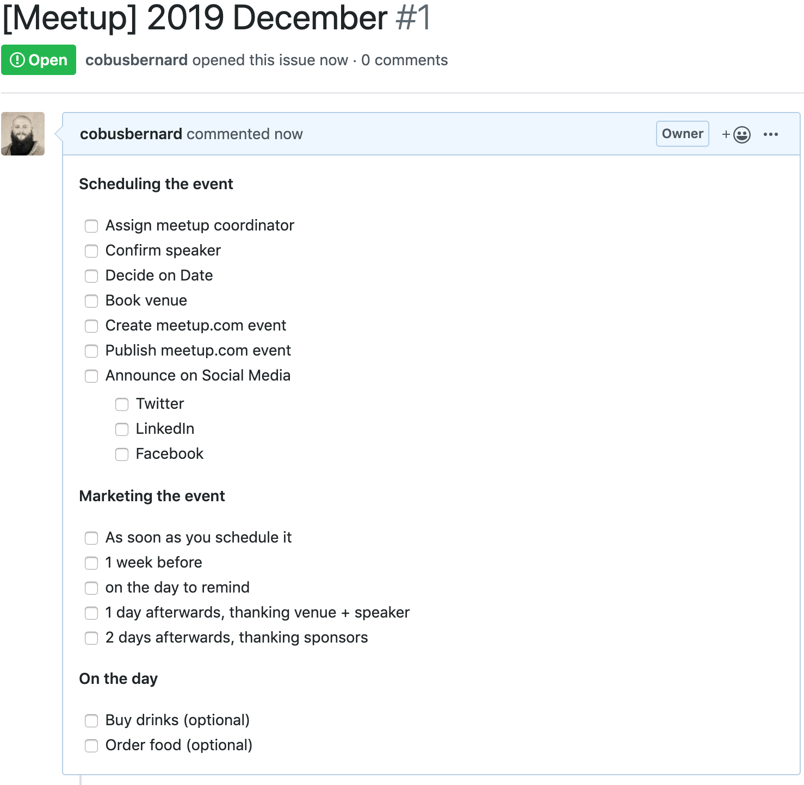

# How to start and run an AWS usergroup
Great! You have decided to run an AWS usergroup in your city / area! This may seem daunting at first, but here are some suggestions on how to make it easier to run. For the latest FAQ / details, please see the [official AWS Usergroup Guide](https://aws.amazon.com/developer/community/usergroups/) page. Please also reach out to your local AWS Technical Evangelist - you can find them [on this page](https://aws.amazon.com/developer/community/evangelists/).

# Group setup
## Meetup.com
First thing you probably want to do is create a group on [Meetup.com](https://meetup.com). For this, you will need to also create a group icon, please read through the guidlines in [this](resources/AWS_UserGroup_LogoTemplate.pptx) and [this](resources/AWS_UserGroup_LogoTemplate_2018.pptx) file. It provides starting point graphics for you to use for the group, making it really easy to have a high quality icon / banner for your group.

## Social media
In addition to using [Meetup.com](https://meetup.com) to schedule and advertise your new group, it helps to spread awareness using various social media channels. The recommendations is to create a (Twitter)[https://twitter.com], (LinkedIn Company Page)[https://business.linkedin.com/marketing-solutions/linkedin-pages#] and (Facebook group)[https://facebook.com]. Using a scheduling tool to schedule posts really helps with the admin - something like (Buffer)[https://buffer.com].

# Organising a first meetup
Recommend reading through [this post](https://www.offerzen.com/blog/6-pro-tips-to-host-a-kick-ass-meetup) and [this checklist](https://github.com/facebookarchive/DeveloperEventGuidelines/blob/master/MeetupOrganizerTimeline.md) to get an idea of what is involved. Using issues to track a meetup makes it easy to track which tasks have been completed. Using issue templates makes this super easy - please look at [how to create them](https://help.github.com/en/articles/creating-issue-templates-for-your-repository) as well as [this sample](https://github.com/cobusbernard/aws-usergroups/tree/master/.github/ISSUE_TEMPLATE). This will allow you to create an issue with a list of checkboxes of tasks to complete similar to:

